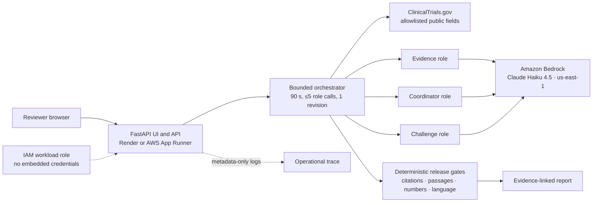

# TrialGuard

TrialGuard is an evidence-linked second reviewer for clinical-trial planning. Give
it a ClinicalTrials.gov NCT ID and it finds comparable stopped trials, preserves
their documented registry reasons, drafts operational questions, and refuses to
release unsupported claims.

It does **not** predict efficacy, recommend protocol changes, or make clinical,
regulatory, or go/no-go decisions. Its output is for qualified human review.

Public applications:

- [Live Bedrock demo](https://commerce-terminal-contamination-chosen.trycloudflare.com/) —
  arbitrary valid NCT IDs while the temporary laptop tunnel remains awake.
- [Durable Render fallback](https://trialguard-5erc.onrender.com/) — the two
  prepared reports and grounded chat; visibly replays reviewed public data when
  the registry blocks Render's outbound IP.
- [Static checked showcase](https://shubhamkragrawal.github.io/TrialGuard/) —
  always-on product walkthrough.

Each public page links to ClinicalTrials.gov search so visitors can find more
trial IDs.

## What happens in a review

1. TrialGuard accepts only an NCT ID and fetches allowlisted public registry
   fields from ClinicalTrials.gov.
2. Deterministic code builds a comparison cohort and ranks stopped precedents.
3. Three bounded Amazon Bedrock roles select evidence, draft questions, and
   challenge the draft.
4. Code—not a model—checks citation membership, exact source passages, numbers,
   prohibited wording, and release status.
5. The report exposes its sources, checks, limitations, token usage, and
   execution trace.

Prepared examples:

- `NCT06860815`: active Phase 2 prospective review.
- `NCT06513364`: stopped Phase 2 retrospective review.

## Architecture



The repository includes a credential-free Render blueprint and a
production-oriented private-ECR/App Runner package. Render deploys in checked
demo mode by default and does not call Bedrock. It first attempts current public
ClinicalTrials.gov data and can replay the two reviewed public-data examples if
that registry rejects the host's outbound IP. The fixed orchestration graph
makes three role calls on the normal path and at most five when its single
revision path runs.

The current AWS workshop role can invoke Bedrock but explicitly denies
CloudFormation, ECR, App Runner, Lambda, and Lightsail hosting actions. A static
checked showcase is therefore used for the public presentation fallback; the
full application can deploy to Render without AWS credentials or to App Runner
from an AWS account with the permissions documented in
[DEPLOYMENT.md](DEPLOYMENT.md).

## Deploy on Render

`render.yaml` defines one Docker web service in Render's Virginia region with
the `/health` health check. Application calls to AWS remain pinned to
`us-east-1`. The safe default is credential-free checked-demo generation, a
six-request-per-minute per-client limit, and a configured public live-Bedrock
allowance of 15 shared assessment/chat operations per UTC day if live
generation is later enabled.

Connect this repository as a Render Blueprint and deploy it without adding AWS
credential variables. Live Bedrock must remain disabled unless a durable,
revocable, least-privilege AWS identity has been created specifically for the
deployed service and supplied through Render's secret settings. Never copy the
temporary workshop role's access key, secret, or session token to Render.
Detailed release checks and the limitations of the in-process daily counter are
in [DEPLOYMENT.md](DEPLOYMENT.md).

The current free service is
[trialguard-5erc.onrender.com](https://trialguard-5erc.onrender.com/). Its
ClinicalTrials.gov request is currently answered with HTTP 403, so it serves a
clearly labeled reviewed replay for `NCT06860815` and `NCT06513364`; other IDs
return a registry-unavailable error. The temporary live-Bedrock URL above
continues to support arbitrary valid IDs.

## Run locally

Python 3.10 or newer is recommended; the container uses Python 3.12.

```bash
python3 -m venv .venv
.venv/bin/pip install -e '.[dev]'
.venv/bin/uvicorn app.main:app --reload
```

Open `http://127.0.0.1:8000`. Offline checked-demo mode is the default and still
uses live public registry retrieval.

For live Bedrock generation, authenticate through the normal AWS SDK credential
chain or an IAM workload role—never copy credentials into this repository:

```bash
export TRIALGUARD_AWS_REGION=us-east-1
export TRIALGUARD_BEDROCK_MODEL_ID=us.anthropic.claude-haiku-4-5-20251001-v1:0
export TRIALGUARD_BEDROCK_NATIVE_JSON_SCHEMA=true
export TRIALGUARD_LIVE_BEDROCK_ENABLED=true
export TRIALGUARD_DAILY_LIVE_RUN_LIMIT=15
.venv/bin/uvicorn app.main:app --reload
```

Copy the non-secret defaults from `.env.example` if useful. The application
does not load or persist AWS access keys.

## Verification

```bash
.venv/bin/pytest -q
.venv/bin/ruff check app tests eval
.venv/bin/python -m eval.run_eval --output eval/results.json
docker build --check .
```

Current build:

- 80/80 automated tests pass.
- 7/7 fixed synthetic offline release behaviors match expectations.
- A guarded live `NCT06513364` smoke test reached full release and its
  report-grounded chat returned a checked, source-linked answer.
- Metadata-only assessment and chat events are published to the `TrialGuard`
  CloudWatch metrics namespace and `/trialguard/demo` log group when enabled.
  The AWS demo account also has a `TrialGuard-Demo` dashboard and non-notifying
  assessment/chat latency alarms.

The synthetic suite checks software boundaries; it is not a clinical validation
or a model-quality benchmark.

## Cost metric

TrialGuard records actual Bedrock input/output tokens for each run and computes:

```text
estimated model cost =
  input tokens × input rate / 1,000,000
  + output tokens × output rate / 1,000,000
```

The original live cost baseline on 2026-09-26 used three Nova Lite calls, 10,821 input
tokens, and 1,758 output tokens. At the Amazon Bedrock Standard-tier rates
verified for `us-east-1` that day—$0.06 per million input tokens and $0.24 per
million output tokens—the estimated model cost was **$0.001071**. The run took
11.77 seconds; one observation is not a latency benchmark.

Rates can change. Re-check the
[official Amazon Bedrock pricing page](https://aws.amazon.com/bedrock/pricing/)
before deployment. Hosting, logs, networking, taxes, and free-tier effects are
excluded. The machine-readable observation is in
[`eval/live_metrics.json`](eval/live_metrics.json).

The current guarded Haiku validation used three report-role calls with 10,323
input tokens and 980 output tokens, followed by one grounded chat call with
1,483 input tokens and 56 output tokens. No dollar estimate is claimed until
current Haiku rates are configured.

The configured allowance of 15 shared live operations covers both assessments
and model-backed chat turns. It is an operating guardrail, not a spend cap:
token counts vary and the in-memory counter resets on process restart.

## Security and privacy

- Only public ClinicalTrials.gov fields are accepted; there is no patient or
  protocol upload path.
- NCT IDs must match `^NCT\d{8}$`; URLs and free text are rejected.
- Registry text is treated as untrusted data and scanned for instruction-like
  content before any model call.
- Requests, concurrency, model calls, revisions, and live daily usage are
  bounded.
- Public deployment configuration allows 15 shared live Bedrock assessment/chat
  operations per UTC day per running process; this in-memory demo control
  resets on restart and is not a billing guarantee.
- Credentials, `.env` files, private keys, runtime caches, and generated runs
  are ignored by Git.
- Deployment uses IAM roles and metadata-only operational traces; prompts,
  model responses, request headers, and credentials are not logged.

Before every public push, run the tests and the repository credential scan
described in [DEPLOYMENT.md](DEPLOYMENT.md).

## Repository map

- `app/`: FastAPI application, registry client, bounded roles, and release gates.
- `eval/`: seven fixed synthetic evaluations and one live smoke-test metric.
- `tests/`: unit, integration, orchestration, and UI-route tests.
- `deploy/`: ECR, App Runner, least-privilege IAM, and optional budget templates.
- `slides/`: editable presentation source, deck, and product screenshot.
- `docs/`: static public showcase for GitHub Pages.

See [DEVELOPMENT_PLAN.md](DEVELOPMENT_PLAN.md) for scope and milestone rationale.
