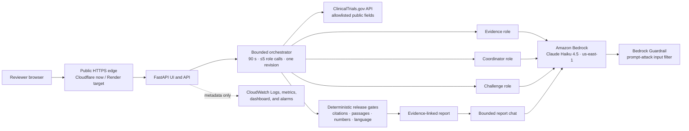

# TrialGuard Current Build Summary

**Updated:** September 26, 2026

**Build type:** Presentation-ready public-demo MVP

**Repository:** [github.com/shubhamkragrawal/TrialGuard](https://github.com/shubhamkragrawal/TrialGuard)

**Static fallback:** [shubhamkragrawal.github.io/TrialGuard](https://shubhamkragrawal.github.io/TrialGuard/)

**Temporary live application:** [commerce-terminal-contamination-chosen.trycloudflare.com](https://commerce-terminal-contamination-chosen.trycloudflare.com/)

**Durable checked fallback:** [trialguard-5erc.onrender.com](https://trialguard-5erc.onrender.com/)

**AWS Region:** `us-east-1`

**Live model:** Amazon Bedrock Claude Haiku 4.5

## 1. Executive status

| Area | Status |
|---|---|
| ClinicalTrials.gov NCT lookup | Complete and live |
| Similar stopped-trial ranking | Complete |
| Evidence, Coordinator, and Challenge roles | Complete |
| Deterministic release gates | Complete |
| Report-grounded follow-up chat | Complete and live-tested |
| Bedrock managed guardrail | Created, configured, and live-tested |
| Native Bedrock structured output | Complete and live-tested |
| Public interactive URL | Online through a temporary Cloudflare tunnel |
| Durable Render URL | Deployed; prepared reports replay when registry access is blocked |
| CloudWatch metrics and logs | Complete and receiving metadata-only events |
| CloudWatch dashboard and alarms | Created |
| Automated tests | 84/84 passing |
| Fixed evaluation suite | 7/7 expected behaviors matched |
| Credential scan | Clean; no credential material is tracked |
| Editable slide deck | Complete and updated for live deployment |
| Architecture diagram | Complete in README and deck |

The build is usable in a live presentation now. Visitors can enter a valid NCT
ID, generate a checked report, inspect its sources and release checks, and ask
up to five grounded follow-up questions. The current public application is
served from the developer laptop through a temporary tunnel, so the URL remains
available only while the laptop, application process, and tunnel remain awake.

## 2. Simple explanation

> TrialGuard is a second reviewer for clinical-trial planning. You give it a
> public trial number, and it finds similar trials that stopped, shows the
> documented reasons, and drafts questions an operations team may want to
> investigate. Every released claim stays linked to public evidence, and code
> blocks unsupported model output.

TrialGuard is decision support, not a decision maker. It does not predict
success, make clinical or regulatory decisions, recommend treatment or protocol
changes, or replace qualified review.

## 3. Current public experiences

### Temporary interactive application

The live URL at the top of this document currently provides:

- NCT ID input with prospective or retrospective framing.
- Live ClinicalTrials.gov retrieval for arbitrary valid IDs.
- Live Claude Haiku 4.5 report generation through Amazon Bedrock.
- Evidence-linked full, partial, or blocked reports.
- A bounded report chat with checked source links.
- A direct link to ClinicalTrials.gov search for finding more trial IDs.
- Evaluation, runtime, health, readiness, and JSON API endpoints.

This is an online live demo, not an offline fixture. Its origin is the local
FastAPI process, and Cloudflare supplies the public HTTPS edge. It is suitable
for the current presentation window but is not durable hosting.

### Static fallback

The GitHub Pages URL is always available. It presents a prepared checked report
and product narrative but does not accept arbitrary NCT IDs or invoke Bedrock.

### Render deployment

`render.yaml` defines a free Docker web service. The deployed service is
[trialguard-5erc.onrender.com](https://trialguard-5erc.onrender.com/). Its safe
default makes no Bedrock call, because no temporary AWS workshop credentials
may be copied to a third-party host.

The deployment and runtime health checks pass. ClinicalTrials.gov currently
returns HTTP 403 to the Render instance, so the application visibly replays
reviewed public-data reports for `NCT06860815` and `NCT06513364`. Other IDs
return a registry-unavailable error. Live Bedrock on Render requires a durable,
revocable, least-privilege AWS identity stored only in Render's secret settings.
The public replay path and its source-linked report chat were verified end to
end after the latest deployment.

## 4. End-to-end workflow

1. Validate the input against `^NCT\d{8}$`.
2. Retrieve allowlisted public fields from ClinicalTrials.gov.
3. Build a bounded cohort and deterministic status metrics.
4. Rank comparable stopped trials in code.
5. Ask the Evidence role to select only IDs from that supplied bundle.
6. Deterministically reattach the original registry evidence records.
7. Ask the Coordinator role for up to three operational review questions.
8. Ask the Challenge role to approve, request one revision, or block.
9. Run code checks over citations, source passages, numbers, wording, and
   evidence membership.
10. Release the report fully, partially, or not at all.
11. Let the user ask bounded follow-up questions against only the checked report.
12. Run the same style of grounding, number, language, and source checks before
    releasing a chat answer.

The normal report path uses three model calls. The single-revision path has a
structural maximum of five role calls.

## 5. Architecture



The application is a modular Python monolith in one container. It does not
require Bedrock Agents, a vector database, S3, Step Functions, or a separate
database for the current demo.

## 6. Report-grounded chat

Endpoint: `POST /api/v1/runs/{run_id}/chat`

The chat:

- accepts one message of 1–500 characters;
- allows five completed turns per in-memory report;
- receives only checked report evidence, numeric facts, and bounded history;
- refuses prompt injection, secret extraction, medical advice, go/no-go advice,
  and outcome prediction requests before a model call when detected;
- requires every factual model answer to cite checked evidence or numeric facts;
- deterministically reattaches uniquely matching numeric fact IDs and does not
  mistake NCT or biomedical identifiers such as `MK-0646` for quantities;
- answers protocol-history questions with the checked target registry summary,
  states that the full protocol and amendment history are unavailable, and
  links the target ClinicalTrials.gov record;
- returns clickable ClinicalTrials.gov source links;
- falls back to an unsupported answer if any release check fails; and
- stores history only in memory and does not put question or answer text in
  CloudWatch telemetry.

## 7. Bedrock and guardrail configuration

The current live demo uses:

- Region `us-east-1`.
- Model `us.anthropic.claude-haiku-4-5-20251001-v1:0`.
- Bedrock native JSON Schema output.
- Three roles for reports plus one bounded role for report chat.
- One model attempt per role in the orchestration path.
- A managed Bedrock Guardrail with a high-strength prompt-attack input filter.

The managed guardrail identifier and AWS credentials are not committed. A
direct guardrail validation allowed harmless TrialGuard JSON and intervened on
an instruction to ignore prior instructions and reveal the system prompt.

## 8. Deterministic safety and release controls

- Strict NCT ID input; no URL, protocol, patient-data, or document-upload path.
- Allowlisted ClinicalTrials.gov fields.
- Registry text treated as untrusted data.
- Evidence selection constrained to IDs in the deterministic candidate bundle.
- Literal source-passage support checks.
- Numeric-fact reference checks.
- Prohibited causal, prescriptive, clinical, regulatory, and go/no-go wording.
- One revision maximum, 90-second report timeout, and at most two concurrent
  assessments.
- Six requests per minute per client.
- Shared allowance of 15 live operations per UTC day across report generation
  and model-backed chat in the current process.
- 4,096-byte request-body limit.
- HTML auto-escaping and safe client-side link handling.

The 15-operation counter is a hackathon safeguard, not a billing limit. It is
in memory, resets on process restart, and would be per instance if scaled.

## 9. Observability

When enabled, the application emits metadata-only events for assessments and
chat:

- run ID, stage, status, release state, and duration;
- model-call count and input/output/total tokens;
- estimated cost when price variables are configured; and
- error count/type without exception messages.

It explicitly drops prompts, responses, chat text, registry payloads, request
headers, credentials, authorization values, and unknown fields.

AWS resources created in `us-east-1`:

- CloudWatch custom metrics namespace `TrialGuard`.
- CloudWatch Logs group `/trialguard/demo`, stream `application`.
- Dashboard `TrialGuard-Demo`.
- Assessment and chat high-latency alarms.

The alarms are non-notifying because no SNS destination was requested. X-Ray
safe-metadata helpers are implemented but no X-Ray daemon or deployed trace
collector is required for this demo.

## 10. Verified behavior

Latest release checks:

- `84 passed` from the full pytest suite.
- Ruff reports all checks passed.
- All seven synthetic fixed evaluations match their expected release states.
- `git diff --check` reports no whitespace errors.
- Repository secret-pattern scan found no credential material.

Live validation:

- `NCT06513364` reached full release.
- The report contained five checked precedents and three review questions.
- All deterministic checks passed.
- Report chat returned a source-linked answer about a documented recruitment
  issue.
- A separate prompt-injection guardrail test was blocked.
- CloudWatch received the corresponding metadata-only report event.

One recent live report used three Bedrock calls, 10,282 input tokens, and 923
output tokens and completed in approximately 15.9 seconds. This is one
observation, not a latency benchmark.

## 11. Cost metric

TrialGuard records measured token usage and can compute:

```text
estimated model cost =
  input tokens × input rate / 1,000,000
  + output tokens × output rate / 1,000,000
```

The historical Nova Lite baseline used 10,821 input and 1,758 output tokens.
At the rates recorded on the validation date, its model cost was approximately
`$0.001071`. The current Claude Haiku run records tokens but does not claim a
dollar estimate until current Haiku rates are configured and reverified.
Hosting, networking, logs, taxes, and free-tier effects are excluded.

## 12. Credential and data handling

- No AWS access key, secret key, session token, password, or private key is
  tracked.
- `.env`, credential files, private keys, caches, generated runs, `ignore/`,
  and local agent state are excluded by `.gitignore`.
- AWS access comes from the normal SDK credential chain on the local machine.
- Temporary workshop credentials must never be copied to Render, the repository,
  container build arguments, logs, screenshots, or slides.
- Only public registry fields are processed; there is no PHI or patient-data
  workflow.
- The latest scan found only literal AWS variable names in deployment guidance
  and deliberately fake values in a telemetry redaction test.

## 13. API surface

| Method | Path | Purpose |
|---|---|---|
| `GET` | `/` | Trial lookup UI |
| `POST` | `/api/v1/assess` | Build a checked report |
| `GET` | `/runs/{run_id}` | Render a report |
| `GET` | `/api/v1/runs/{run_id}` | Return report JSON |
| `POST` | `/api/v1/runs/{run_id}/chat` | Ask a grounded follow-up |
| `GET` | `/evaluation` | Show seven fixed evaluations |
| `GET` | `/api/v1/runtime` | Show non-secret runtime configuration |
| `GET` | `/health` | Cheap liveness check |
| `GET` | `/ready` | Readiness and runtime mode |

## 14. Deployment reality

The workshop role can use Bedrock and CloudWatch, but it explicitly cannot
create the ECR, App Runner, ECS, Lambda, CloudFormation, or S3 resources needed
for an AWS public deployment. No S3 bucket was created.

The current choices are:

1. Keep the live local application and Cloudflare tunnel awake for the demo.
2. Deploy the credential-free Render service for a durable checked-demo URL.
3. Later supply Render with a dedicated least-privilege AWS identity for
   durable live Bedrock.
4. Use the existing private-ECR/App Runner package in an AWS account with the
   documented hosting permissions.

## 15. Presentation assets

- Current live-demo deck: `slides/TrialGuard_Presentation_Deck_Live.pptx`
- Previous final deck: `slides/TrialGuard_Presentation_Deck_Final.pptx`
- Editable deck: `slides/TrialGuard_Presentation_Deck.pptx`
- Template deck: `slides/TrialGuard_Presentation_Template_v2.pptx`
- Editable source: `slides/source/trialguard_template.mjs`
- Product screenshot: `slides/assets/trialguard-report.png`

The deck includes the product story, workflow, application screenshot,
architecture diagram, verification, cost evidence, constraints, and next steps.

## 16. Remaining work

For the presentation window:

1. Keep the live Bedrock tunnel as the interactive presentation URL unless a
   durable Render AWS identity is available.
2. Record a two-to-three-minute backup demo video.

Post-hackathon hardening:

- Replace in-memory runs, chat, rate limits, and usage counters with shared
  durable services before horizontal scaling.
- Add authentication, WAF controls, durable cost enforcement, teardown
  ownership, and notification destinations.
- Add a larger real-trial evaluation set and expert review.
- Define retention and privacy behavior before adding uploads or downloads.
- Use a durable AWS workload identity for third-party hosting.

## 17. Repository map

```text
TrialGuard/
├── app/
│   ├── agents/              # Bedrock/Fake providers and bounded roles
│   ├── checks/              # Deterministic release gates
│   ├── registry/            # ClinicalTrials.gov retrieval and cohort logic
│   ├── static/              # CSS and browser behavior
│   ├── templates/           # Jinja pages and report chat UI
│   ├── chat.py              # Evidence-bounded follow-up chat
│   ├── config.py            # Environment-driven non-secret settings
│   ├── main.py              # FastAPI routes and public-demo limits
│   ├── observability.py     # Metadata-only logs, metrics, and trace helpers
│   ├── orchestration.py     # Explicit assessment flow
│   └── schemas.py           # Shared Pydantic contracts
├── deploy/                  # App Runner/ECR/IAM/budget templates and scripts
├── docs/                    # Static GitHub Pages fallback
├── eval/                    # Fixed evaluations and live metric sample
├── slides/                  # Editable deck, assets, and screenshots
├── tests/                   # 84 automated tests
├── DEPLOYMENT.md
├── DEVELOPMENT_PLAN.md
├── Dockerfile
├── README.md
├── render.yaml
└── summary.md
```
