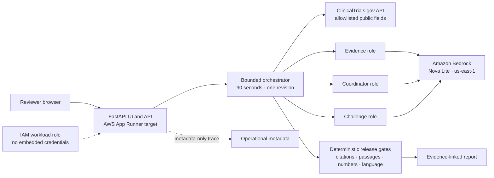

# TrialGuard Current Build Summary

**Updated:** September 26, 2026  
**Build type:** Presentation-ready hackathon MVP  
**Repository:** [github.com/shubhamkragrawal/TrialGuard](https://github.com/shubhamkragrawal/TrialGuard)  
**Public showcase:** [shubhamkragrawal.github.io/TrialGuard](https://shubhamkragrawal.github.io/TrialGuard/)  
**AWS Region:** `us-east-1`  
**Bedrock model:** `us.amazon.nova-lite-v1:0`

## 1. Executive status

| Area | Current status |
|---|---|
| Core application | Complete and working locally |
| ClinicalTrials.gov integration | Complete; uses the public API |
| Amazon Bedrock integration | Complete and live-tested in `us-east-1` |
| Evidence, Coordinator, and Challenge roles | Complete |
| Deterministic release gates | Complete |
| Presentation-quality web interface | Complete |
| Public URL | Live static checked showcase |
| Dynamic AWS public deployment | Packaged but blocked by the workshop IAM role |
| Automated tests | 52/52 passing |
| Fixed evaluation suite | 7/7 expected behaviors matched |
| Docker image | Builds and passes local health/readiness smoke tests |
| Architecture diagram | Complete in the README and final slide deck |
| Cost measurement | Complete for one live smoke test |
| Presentation deck | Complete and editable |
| Credential scan | Clean at the time of the release push |
| Git status at the start of this summary | `main` synchronized with `origin/main` at `e8c8e06` |

TrialGuard is ready to present as a hackathon or portfolio MVP. The full dynamic
application can run locally and has a production-oriented App Runner deployment
package. The public URL currently provides a polished static demonstration
rather than arbitrary live trial execution.

## 2. What the product does

TrialGuard is an evidence-linked second reviewer for clinical-trial operations.
A user supplies a ClinicalTrials.gov NCT ID. TrialGuard then:

1. Retrieves selected public fields for that registered trial.
2. Builds a bounded group of comparable public studies.
3. Finds similar stopped trials.
4. Preserves the exact registry stop-reason passages and source links.
5. Drafts operational questions for a qualified human reviewer.
6. Challenges the draft for weak support or overreach.
7. Runs deterministic citation, passage, number, and wording checks.
8. Releases the report fully, partially, or not at all.

The main value is traceability. A reviewer can see which public record supports
each trial-specific point and which checks passed before the output was shown.

### Simple explanation

> TrialGuard is a second reviewer for clinical-trial planning. It looks at a
> registered trial, finds similar trials that stopped, shows the documented
> reasons, and suggests questions the operations team should examine. It keeps
> the evidence attached and blocks unsupported claims.

## 3. Intended use and boundaries

TrialGuard is intended for:

- Clinical-operations teams.
- Trial-planning and feasibility reviewers.
- Innovation, hackathon, and portfolio demonstrations.
- Qualified humans reviewing public clinical-trial evidence.

TrialGuard does not:

- Predict whether a trial will succeed.
- Produce a termination probability or risk score.
- Recommend protocol changes.
- Make efficacy, safety, clinical, regulatory, legal, or go/no-go decisions.
- Accept patient data, PHI, confidential protocols, or document uploads.
- Replace expert judgment.
- Establish causation from registry similarity.

The product is decision support, not a decision maker.

## 4. Current user experiences

### Public checked showcase

The live public URL is:

[https://shubhamkragrawal.github.io/TrialGuard/](https://shubhamkragrawal.github.io/TrialGuard/)

It contains:

- Product positioning and intended-use language.
- A prepared report experience based on the public example ID `NCT06860815`.
- A visibly labeled synthetic/checked evidence card and question.
- A release-check view.
- The seven-case evaluation summary.
- Product limitations.
- A source-repository link.
- A **Find more NCT IDs** link to
  [ClinicalTrials.gov search](https://clinicaltrials.gov/search).

The public site clearly states that it is a static prepared showcase and does
not make a live Bedrock request. Visitors can browse ClinicalTrials.gov for
additional trial IDs, but arbitrary IDs cannot currently be executed on the
static GitHub Pages site.

### Full dynamic application

The full FastAPI application supports:

- NCT ID input and prospective/retrospective framing.
- Live ClinicalTrials.gov retrieval.
- Offline checked-demo generation using deterministic fixtures.
- Live Amazon Bedrock generation when enabled.
- A polished report with sources, questions, checks, limitations, and trace.
- A JSON assessment API.
- Runtime, liveness, readiness, and evaluation endpoints.

Prepared application examples:

- `NCT06860815`: active Phase 2 prospective-review example.
- `NCT06513364`: stopped Phase 2 retrospective-review example.

## 5. Current architecture



The application is a modular Python monolith in one container. It does not use
Bedrock Agents, Step Functions, SQS, a vector database, or a separate database
service for this release.

## 6. End-to-end assessment flow

### Input and retrieval

1. The request accepts an NCT ID and an assessment mode.
2. The NCT ID must match `^NCT\d{8}$`.
3. User-provided URLs, protocols, and free-text instructions are not accepted.
4. The application retrieves the target record from ClinicalTrials.gov.
5. The normalizer keeps selected public fields and excludes arbitrary registry
   sections and contact details.
6. The application derives comparison filters from the target.
7. It retrieves a bounded cohort with pagination metadata.
8. It computes deterministic status counts.
9. A resolved-study stop rate is shown only when the cohort retrieval is
   complete.

### Evidence and model roles

10. Deterministic code ranks candidate stopped trials.
11. The Evidence role selects supported precedents from the supplied bundle.
12. Citation membership and literal source-passage checks validate the
    selection.
13. The Coordinator role drafts up to three operational review questions.
14. Generated questions are instructed not to include free-form numeric values;
    deterministic cohort metrics are rendered separately.
15. The Challenge role approves, requests one revision, or blocks the draft.
16. If one revision is requested, the Coordinator and Challenge roles run once
    more.

### Release

17. Deterministic checks run over the final content.
18. Failed global checks block the report.
19. Failed item-level checks can produce a partial release.
20. A clean result receives full release.
21. The report displays evidence, questions, limitations, checks, trace events,
    model metadata, token counts, and estimated model cost when rates are
    configured.

The fixed graph uses three provider calls in a normal run and no more than five
provider calls when the single revision path is exercised. Live provider
retries are configured to one attempt in the current orchestration path.

## 7. Implemented components

### Registry layer

Location: `app/registry/`

- Strict NCT ID validation.
- ClinicalTrials.gov public API client.
- Response and not-found error handling.
- Allowlisted study normalization.
- Cohort filter derivation.
- Bounded cohort retrieval and pagination tracking.
- Status counts and eligible deterministic numeric facts.
- Deterministic precedent ranking.
- Relevance-feature summaries.

### Bedrock role layer

Location: `app/agents/`

- `BedrockConverseProvider` for live structured generation.
- `FakeProvider` for deterministic tests and offline demonstrations.
- Pydantic output-schema validation.
- Per-role timeouts.
- Safe operational metadata and token accounting.
- No retained chain-of-thought.
- No raw model response storage in `LLMResult`.
- Evidence role.
- Coordinator role.
- Challenge role.

### Deterministic checks

Location: `app/checks/`

- Citation bundle membership.
- Literal source-passage support.
- Numeric-fact reference matching.
- Prohibited causal, prescriptive, clinical, and go/no-go wording.
- Prompt-injection pattern detection in untrusted registry fields.
- Full, partial, and blocked release aggregation.

Models cannot override a failed deterministic release check.

### Orchestration

Location: `app/orchestration.py`

- Explicit sequential assessment flow.
- Automatic retrospective labeling for resolved trials requested as
  prospective.
- Maximum one revision.
- Provider failure conversion into a blocked report.
- Trace events with stage, duration, model, token, evidence, and check metadata.
- Usage and configurable cost aggregation.

### Web application

Location: `app/main.py`, `app/templates/`, and `app/static/`

- FastAPI application.
- Server-rendered Jinja pages.
- Responsive presentation-quality UI.
- Prepared demo IDs.
- HTML report and JSON API.
- Evaluation page.
- Error and blocked states.
- In-memory storage for the 25 most recent reports.
- Per-IP request throttling.
- Daily UTC live-run counter.
- Two concurrent assessment slots.
- 4,096-byte request-body limit.
- 90-second end-to-end timeout.

### Static public showcase

Location: `docs/`

- Self-contained HTML, CSS, and JavaScript.
- No package or remote-asset dependency.
- Hash-based page navigation.
- Prepared report, evaluation, and boundary views.
- Clear labels separating static demonstration content from live execution.
- ClinicalTrials.gov search link for finding more NCT IDs.

### Evaluation and tests

Locations: `tests/` and `eval/`

- Unit tests for schemas, registry retrieval, cohorts, checks, agents, costs,
  orchestration, and application routes.
- Fixed synthetic release-behavior fixtures.
- Machine-readable evaluation output.
- Machine-readable live smoke-test metric.

### Deployment

Locations: `Dockerfile`, `apprunner.yaml`, `deploy/`, and `DEPLOYMENT.md`

- Python 3.12 slim container.
- Non-root runtime user.
- Built-in HTTP health check.
- Private ECR repository template.
- ECR encryption, immutable tags, scan on push, and image lifecycle policy.
- App Runner service template.
- Public HTTPS ingress.
- Default outbound access for ClinicalTrials.gov and Bedrock.
- Least-privilege ECR access role.
- Bedrock runtime role scoped to supplied resource ARNs.
- Bounded App Runner autoscaling.
- Optional account-wide AWS Budget template.
- Immutable image-digest deployment scripts.
- Teardown and validation instructions.

### Presentation

Location: `slides/`

- Editable six-slide source.
- Final PowerPoint deck.
- Actual product screenshot.
- Native editable architecture diagram.
- Verified test, evaluation, live-run, latency, token, and cost metrics.
- Limits and deployment-status slide.

The current final deck is:

`slides/TrialGuard_Presentation_Deck_Final.pptx`

## 8. API and page inventory

| Method | Route | Purpose |
|---|---|---|
| `GET` | `/` | Landing page, input form, and prepared examples |
| `POST` | `/api/v1/assess` | Run an HTML-form or JSON assessment |
| `GET` | `/runs/{run_id}` | Render a checked report |
| `GET` | `/api/v1/runs/{run_id}` | Return a checked report as JSON |
| `GET` | `/evaluation` | Display fixed evaluation behavior |
| `GET` | `/api/v1/runtime` | Return non-secret runtime configuration |
| `GET` | `/health` | Cheap liveness check with no external call |
| `GET` | `/ready` | Return configuration readiness without invoking a model |
| `GET` | `/api/docs` | FastAPI OpenAPI documentation |

## 9. Shared report contracts

The current Pydantic schema layer includes:

| Object | Role |
|---|---|
| `AssessRequest` | Validated NCT ID and review mode |
| `TrialRecord` | Allowlisted normalized target or cohort trial |
| `EvidenceItem` | Source-linked stopped-trial precedent |
| `CohortResult` | Filters, counts, completeness, and optional rate |
| `NumericFact` | Deterministically derived number with provenance |
| `ReviewQuestion` | Question, explanation, uncertainty, and evidence IDs |
| `ChallengeDecision` | Approve, revise, or block decision and findings |
| `CheckResult` | Deterministic check status and reason |
| `TraceEvent` | Metadata-only execution event |
| `UsageSummary` | Calls, tokens, price basis, and estimated cost |
| `AssessmentReport` | Complete checked output and release state |

Trial-specific generated points must reference evidence IDs in the current
bundle. Generated numbers must match referenced deterministic numeric facts.

## 10. Amazon Bedrock configuration

Current live configuration:

| Setting | Value |
|---|---|
| Region | `us-east-1` |
| Model/inference profile | `us.amazon.nova-lite-v1:0` |
| Interface | Bedrock Runtime Converse |
| Temperature | `0.0` |
| Maximum structured output | 1,200 tokens per role call |
| Default report timeout | 90 seconds |
| Normal role calls | 3 |
| Revision limit | 1 |
| Maximum graph role calls | 5 |
| Provider retries in current live path | 1 attempt |
| Guardrail | Optional; not configured in the current smoke test |

Authentication is deliberately absent from application settings. `boto3` uses
its normal credential provider chain, allowing local SSO/profile sessions and
AWS workload IAM roles.

No AWS access key, secret key, or session token is present in source,
`.env.example`, Docker build arguments, CloudFormation templates, slides, or
public pages.

## 11. Security and privacy controls

### Input and data scope

- NCT ID only.
- 4 KB request-body limit.
- Selected public ClinicalTrials.gov fields only.
- No patient, PHI, private protocol, or document upload path.
- No user-supplied retrieval URL.

### Model boundaries

- Separate system prompts and structured contracts for each role.
- Registry text is explicitly treated as untrusted data.
- Instruction-like registry content is checked before a model call.
- Roles cannot choose arbitrary endpoints or tools.
- Roles cannot calculate cohort statistics.
- Coordinator output is phrased as review questions.
- Challenge output cannot bypass deterministic checks.

### Runtime limits

- Six requests per minute per client IP by default.
- Fifty live assessments per UTC day by default.
- Two concurrent assessments per application process.
- 90-second end-to-end timeout.
- One revision.
- Fixed orchestration graph with at most five role calls.
- The 25 most recent reports are kept in process memory.

### Credential handling

- `.env`, `.env.*`, `.aws/`, private keys, credential JSON, and secret JSON are
  ignored.
- The Docker build excludes local environments, cloud profiles, keys,
  credentials, runtime data, tests, deployment files, and slides.
- Deployment uses IAM roles rather than embedded credentials.
- Operational traces contain metadata rather than raw prompts, raw responses,
  headers, or credentials.
- Source, Git history, slide, and container-history credential-pattern scans
  were clean before the release push.

## 12. Verification results

### Automated checks

```text
52/52 automated tests passed
Ruff checks passed
7/7 fixed synthetic evaluation behaviors matched
Docker build check passed
Full Python 3.12 container build passed
Container /health, /ready, and / smoke tests passed
CloudFormation YAML parsing passed
Deployment shell syntax checks passed
Presentation package integrity passed
Presentation geometry checks passed with zero findings
Public GitHub Pages URL returned the expected application title
ClinicalTrials.gov search link returned successfully
Credential-pattern scans returned no findings
```

### Seven fixed evaluation cases

| Case | Expected behavior | Observed |
|---|---|---|
| Evidence-rich analogue | Full release | Matched |
| Sparse-evidence analogue | Partial release | Matched |
| Invalid NCT ID | Blocked | Matched |
| Resolved trial requested as prospective | Blocked in the synthetic gate fixture | Matched |
| Injected instruction in registry text | Blocked | Matched |
| Fabricated citation | Blocked | Matched |
| Numeric mismatch | Blocked | Matched |

These fixtures test software release behavior. They do not establish clinical
accuracy, clinical utility, safety, or regulatory suitability.

## 13. Live smoke-test result and cost

One final live smoke test used:

| Metric | Observed value |
|---|---:|
| Trial | `NCT06860815` |
| Region | `us-east-1` |
| Model | `us.amazon.nova-lite-v1:0` |
| Release state | Full |
| Questions | 2 |
| Deterministic checks | 14/14 passed |
| Bedrock calls | 3 |
| Input tokens | 10,821 |
| Output tokens | 1,758 |
| End-to-end time | 11.77 seconds |
| Estimated Bedrock model cost | **$0.001071** |

The estimate uses Amazon Nova Lite Standard-tier rates verified on
September 26, 2026:

- $0.06 per million input tokens.
- $0.24 per million output tokens.

Formula:

```text
estimated model cost =
  input tokens × input rate / 1,000,000
  + output tokens × output rate / 1,000,000
```

This is one observed smoke test, not a latency, quality, or cost benchmark.
Hosting, networking, logging, taxes, and free-tier effects are excluded. Rates
can change and should be rechecked at the
[official Amazon Bedrock pricing page](https://aws.amazon.com/bedrock/pricing/).

Machine-readable data is stored in `eval/live_metrics.json`.

## 14. Deployment status

### What is ready

- Production-style Docker image.
- ECR repository template.
- App Runner service template.
- Least-privilege IAM role definitions.
- Environment-variable contract.
- Image build and push script.
- App Runner deployment script.
- Optional budget alert.
- Health and readiness routes.
- Deployment validation and teardown documentation.

### What was successfully exercised

- Live Bedrock Converse calls in `us-east-1`.
- ClinicalTrials.gov public retrieval.
- Local FastAPI application.
- Full Linux/AMD64 Docker build.
- Container liveness, readiness, and homepage.
- Static GitHub Pages publication.

### Why the dynamic AWS URL is not live

The available AWS workshop participant role permits Bedrock inference but
explicitly denied the hosting operations tested during this build:

- CloudFormation template validation.
- ECR repository access.
- App Runner service listing/provisioning.
- Lambda listing.
- Lightsail Containers access.

Because those actions were denied, the build could not create the ECR image
repository, IAM runtime roles, or App Runner service in that account. No attempt
was made to bypass the workshop policy.

The public presentation fallback is GitHub Pages. The full dynamic package can
be deployed from an AWS account or role with the ECR, CloudFormation, App
Runner, IAM, and Bedrock permissions documented in `DEPLOYMENT.md`.

## 15. Local operation

Python 3.10 or newer is recommended. The production container uses Python 3.12.

```bash
python3 -m venv .venv
.venv/bin/pip install -e '.[dev]'
.venv/bin/uvicorn app.main:app --reload
```

Open:

```text
http://127.0.0.1:8000
```

Offline checked-demo mode is the default. It still uses live public registry
retrieval but uses `FakeProvider` rather than Bedrock for the three role outputs.

### Enable live Bedrock

Authenticate through an AWS profile, IAM Identity Center session, or workload
role. Do not place credentials in the project.

```bash
export TRIALGUARD_AWS_REGION=us-east-1
export TRIALGUARD_BEDROCK_MODEL_ID=us.amazon.nova-lite-v1:0
export TRIALGUARD_LIVE_BEDROCK_ENABLED=true
export TRIALGUARD_INPUT_USD_PER_MILLION_TOKENS=0.06
export TRIALGUARD_OUTPUT_USD_PER_MILLION_TOKENS=0.24
.venv/bin/uvicorn app.main:app --reload
```

Recheck pricing before reusing the example rates.

## 16. Verification commands

```bash
.venv/bin/pytest -q
.venv/bin/ruff check app tests eval
.venv/bin/python -m eval.run_eval --output eval/results.json
bash -n deploy/build-and-push.sh deploy/deploy-service.sh
docker build --check .
docker build --platform linux/amd64 --tag trialguard:local .
```

## 17. Important current limitations and gaps

The following are intentionally documented so the current build is not
mistaken for a production clinical system:

1. **The public URL is static.** It demonstrates the output and evaluations but
   cannot execute arbitrary NCT IDs.
2. **Dynamic AWS hosting is not deployed.** The package is ready, but the
   workshop role lacks the required hosting permissions.
3. **Reports are stored in memory.** The application keeps only the 25 most
   recent reports, and they disappear when the process restarts.
4. **Registry caching is not implemented as durable storage.** Cache paths and
   cache-status schema fields are prepared, but live registry reads currently
   go directly to ClinicalTrials.gov.
5. **Rate and daily limits are process-local.** They reset with the process and
   are not coordinated across multiple App Runner instances.
6. **The configured `TRIALGUARD_MODEL_CALL_LIMIT` is exposed in settings and
   deployment configuration, but it is not yet a reusable provider-budget
   wrapper.** The current graph is structurally limited to five role calls.
7. **A separate Challenge model is not currently routed.** Configuration is
   prepared, but the current orchestrator uses the primary provider/model for
   all three roles.
8. **Bedrock Guardrails are optional and not configured in the measured run.**
   Application prompt-injection and deterministic release checks still run.
9. **There is no production authentication, WAF, shared cache, durable run
   store, or multitenancy.**
10. **The live measurement is one sample.** Broader trial coverage, repeated
    latency measurements, expert review, and failure-rate analysis remain to be
    done.
11. **There is no clinical validation.** The fixed evaluations verify software
    behavior only.
12. **ClinicalTrials.gov records are self-reported.** They may be incomplete,
    stale, inconsistent, or non-causal.

## 18. Recommended next steps

### Highest priority

1. Deploy the existing App Runner package from an authorized AWS account.
2. Verify exact Bedrock inference-profile and foundation-model ARNs for the IAM
   policy.
3. Add a durable shared rate counter and daily usage counter.
4. Add a reviewed registry cache and prepared fallback reports.
5. Add persistent run storage with retention and deletion controls.

### Security and reliability

6. Put CloudFront and AWS WAF in front of the service for longer-lived public
   use.
7. Add authentication if the service moves beyond a bounded public demo.
8. Enable and evaluate an optional Bedrock Guardrail.
9. Add a central call-budget wrapper around the provider.
10. Add alarms, dashboards, and explicit teardown ownership.

### Evaluation and product

11. Run a larger set of real public trials across conditions and phases.
12. Measure release rate, blocked-output rate, latency distribution, and cost
    distribution.
13. Have clinical-operations experts review evidence relevance and question
    usefulness.
14. Add report download only after retention and privacy behavior are defined.
15. Consider a stronger Challenge model only if quality improvement justifies
    added latency and cost.

## 19. Repository map

```text
TrialGuard/
├── app/
│   ├── agents/              # Bedrock/Fake providers and three bounded roles
│   ├── checks/              # Deterministic release gates
│   ├── registry/            # ClinicalTrials.gov retrieval and cohort logic
│   ├── static/              # Full application CSS and JavaScript
│   ├── templates/           # Full application Jinja pages
│   ├── config.py            # Environment-driven non-secret settings
│   ├── costs.py             # Token and estimated-cost aggregation
│   ├── main.py              # FastAPI routes and public-demo limits
│   ├── orchestration.py     # Explicit assessment flow
│   └── schemas.py           # Shared Pydantic contracts
├── deploy/                  # ECR, App Runner, IAM, budget, and scripts
├── docs/                    # Public static GitHub Pages showcase
├── eval/                    # Fixed evaluations and measured live metric
├── slides/                  # Editable source, screenshots, and PowerPoint
├── tests/                   # 52 automated tests and registry fixtures
├── .dockerignore
├── .env.example
├── .gitignore
├── apprunner.yaml
├── DEPLOYMENT.md
├── DEVELOPMENT_PLAN.md
├── Dockerfile
├── README.md
├── summary.md
└── pyproject.toml
```

## 20. Presentation assets

- Final deck: `slides/TrialGuard_Presentation_Deck_Final.pptx`
- Earlier editable deck: `slides/TrialGuard_Presentation_Deck.pptx`
- Template deck: `slides/TrialGuard_Presentation_Template_v2.pptx`
- Editable source: `slides/source/trialguard_template.mjs`
- Product screenshot: `slides/assets/trialguard-report.png`
- Contact sheet: `slides/TrialGuard_Presentation_Deck_contact_sheet.png`

The final deck contains:

1. Product title and positioning.
2. Trial-review problem.
3. Product workflow with a real application screenshot.
4. Editable AWS architecture diagram.
5. Automated evaluation and measured live-run metrics.
6. Limits, public URL, AWS deployment target, and current IAM constraint.

## 21. Current presentation-ready message

The strongest accurate presentation claim is:

> TrialGuard is a working evidence-linked clinical-trial operations reviewer.
> It retrieves public registry data, finds comparable stopped trials, uses three
> bounded Bedrock roles to organize review questions, and gives deterministic
> code final authority over citations, numbers, wording, and release. The
> current build passes 52 automated tests and all seven fixed release-behavior
> evaluations. A live Nova Lite smoke test completed in 11.77 seconds for an
> estimated model cost of $0.001071. The public URL is a checked static showcase;
> the full App Runner package awaits an AWS role with hosting permissions.

